# Rapport d'audit sécurité

## 1. Présentation du projet
Ce projet consiste à développer une application web de gestion de tickets permettant aux utilisateurs de créer, consulter, modifier et supprimer leurs tickets. Un administrateur peut gérer l'ensemble des tickets et des utilisateurs.

Le projet a été réalisé en deux versions :
- vulnerable : version contenant volontairement des vulnérabilités afin de réaliser un audit de sécurité;
- secure : version corrigée dans laquelle les vulnérabilités identifiées sont corrigées.

## 2. Architecture de l'application
### Frontend
- Next.js 16
- React
- TypeScript
- Tailwind CSS

### Backend
- Next.js API Routes
- TypeScript

### Base de données
- MySQL

### ORM
- Prisma

### Authentification
#### Branche `vulnerable`
- JWT
- Stockage du token dans le Local Storage
#### Branche `secure`
- JWT
- Refresh Token
- Cookies HttpOnly

## 3. Installation et lancement
### Installation
npm install


### Configuration
#### Pour la version secure
- Créer un fichier `.env` contenant notamment :
- DATABASE_URL="mysql://..."
-JWT_ACCESS_SECRET=access_secret_secure_change_me
- JWT_REFRESH_SECRET=refresh_secret_secure_change_me
- JWT_ACCESS_EXPIRE=15m
- JWT_REFRESH_EXPIRE=7d
- JWT_SECRET="votre_secret"

#### Pour la version vulnérable
- Créer un fichier `.env` contenant notamment :
- DATABASE_URL="mysql://..."
-JWT_ACCESS_SECRET=access_secret_secure_change_me
- JWT_REFRESH_SECRET=refresh_secret_secure_change_me
- JWT_ACCESS_EXPIRE=15m
- JWT_REFRESH_EXPIRE=7d
- JWT_SECRET="votre_secret"


### Migration Prisma
npx prisma migrate dev

### Lancement du projet
npm run dev

L'application est accessible à l'adresse :
http://localhost:3000

## Branches
- vulnerable :
  Version contenant les vulnérabilités étudiées.
- secure :
  Version corrigée avec les protections mises en place.
- main :
  Version finale recommandée.

## 4. Liste des vulnérabilités intégrées
- Broken Access Control / IDOR
- Information Disclosure
- Input Validation / Injection Risk
- Authentification faible
- Stockage du JWT dans Local Storage
- Absence de validation des entrées
- Mass Assignment / Privilege Escalation
- Security Misconfiguration / Absence de Security Headers

# 5. Audit détaillé des vulnérabilités

# 1 — Broken Access Control / IDOR
## Type
Broken Access Control (IDOR / BOLA)

## Endpoints concernés
- `GET /api/tickets/[id]`
- `PUT /api/tickets/[id]`
- `DELETE /api/tickets/[id]`

## Description
Les opérations de consultation, de modification et de suppression d'un ticket sont réalisées uniquement à partir de son identifiant (`id`).Dans la version vulnerable, l'application ne vérifie pas que le ticket demandé appartient réellement à l'utilisateur authentifié.
Un utilisateur connecté peut donc manipuler l'identifiant présent dans l'URL afin d'accéder aux ressources d'un autre utilisateur.

## Cause
Les méthodes utilisent uniquement l'identifiant du ticket :
- `findUnique()` pour consulter un ticket ;
- `update()` pour modifier un ticket ;
- `delete()` pour supprimer un ticket.

Aucune vérification n'est effectuée sur le propriétaire du ticket (`userId`).
Exemple :
prisma.ticket.findUnique({
  where:{
    id:Number(id)
  }
})

## Exploitation
Un utilisateur authentifié peut modifier l'identifiant du ticket dans l'URL et accéder aux tickets d'un autre utilisateur.

Exemples :
```
GET /api/tickets/2
```
```
PUT /api/tickets/2
```
```
DELETE /api/tickets/2
```
Si le ticket appartient à un autre utilisateur, l'application autorise malgré tout l'opération.

## Preuves
Les preuves sont réalisées avec Postman :
### 1. Consultation non autorisée d'un ticket (GET)
- Un utilisateur authentifié tente d'accéder à un ticket appartenant à un autre utilisateur :
GET /api/tickets/2
Résultat obtenu :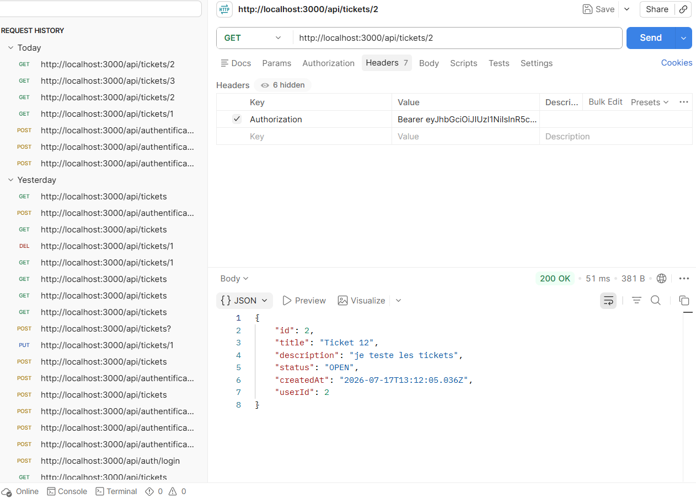

### 2. Modification d'un ticket appartenant à un autre utilisateur (`PUT`)
PUT /api/tickets/2
Résultat obtenu : 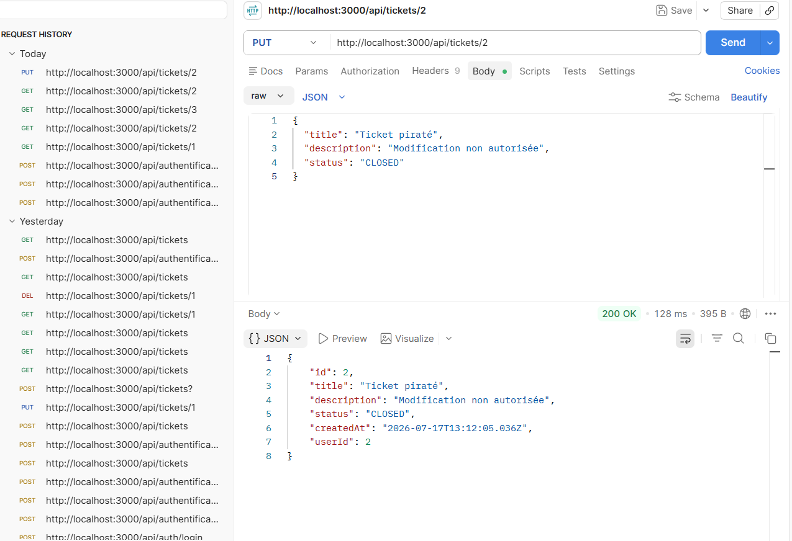

### 3. suppression d'un ticket appartenant à un autre utilisateur (`DELETE`)
DELETE /api/tickets/2
Résultat obtenu : 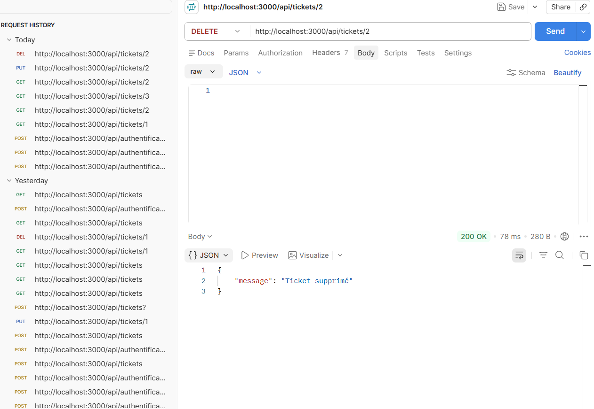

Des captures d'écran des requêtes et des réponses sont jointes au rapport.

## Impact
Cette vulnérabilité permet à un utilisateur malveillant de :
- consulter les données privées d'un autre utilisateur ;
- modifier un ticket qui ne lui appartient pas ;
- supprimer des données appartenant à un autre compte;

Elle compromet :
- La confidentialité des données ;
- L'intégrité des informations ;
- La séparation entre utilisateurs.

## Criticité
Élevée

## Correction appliquée (branche `secure`)
Avant toute opération sur un ticket, l'application vérifie que celui-ci appartient bien à l'utilisateur authentifié.
Exemple :

const ticket = await prisma.ticket.findFirst({
  where: {
    id: Number(id),
    userId: user.id,
  },
});

Si le ticket n'appartient pas à l'utilisateur connecté, l'API retourne une erreur 403 Forbidden ou 404 Not Found.

## Validation après correction
Après application de la correction :
- un utilisateur ne peut consulter que ses propres tickets ;
- un utilisateur ne peut modifier que ses propres tickets ;
- un utilisateur ne peut supprimer que ses propres tickets.
{
  "message": "Accès interdit"
}
Les tentatives d'accès à un ticket appartenant à un autre utilisateur sont désormais refusées.
Résultat obtenu : 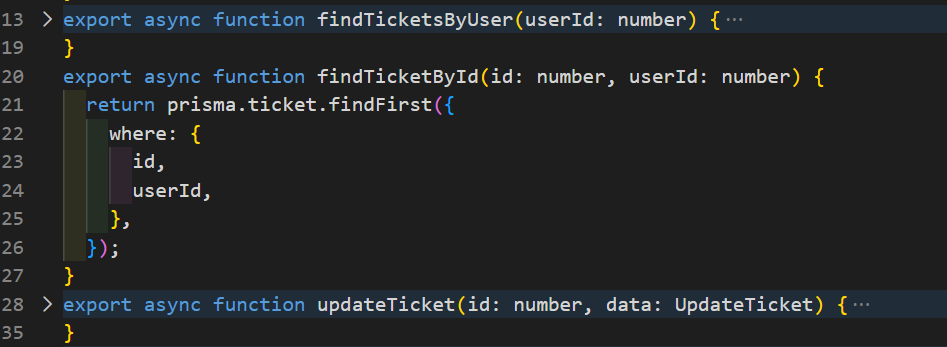

# 2 — Information Disclosure
## Type
Security Misconfiguration / Information Disclosure

## Endpoint concerné
- `POST /api/authentification/login`

## Description
Lors de l'authentification, l'API retourne l'objet utilisateur complet, y compris le hash du mot de passe (`password`). Cette information ne devrait jamais être transmise au client.

## Cause
Après la connexion, l'application renvoie directement l'objet utilisateur récupéré depuis la base de données sans supprimer les informations sensibles.

Exemple :
{
   "id": 3,
    "name": "Brejnev",
    "email": "brejnev@test.com",
    "password": "$2b$10$y6WAR18sSg/mxgHVA7/ntOWXUIncTy7TSOE11fJxUxZxsJ7MPfn7y",
    "role": "USER"
}

## Exploitation
Un attaquant authentifié peut consulter la réponse de l'API et récupérer le hash du mot de passe d'un utilisateur.
Cette information peut être utilisée pour effectuer des attaques hors ligne (offline) afin de tenter de retrouver le mot de passe.

## Preuves
1. Connexion avec un compte utilisateur via Postman.
2. Observation de la réponse JSON.
3. Présence du champ `password` dans l'objet `user`.

Résultat obtenu : 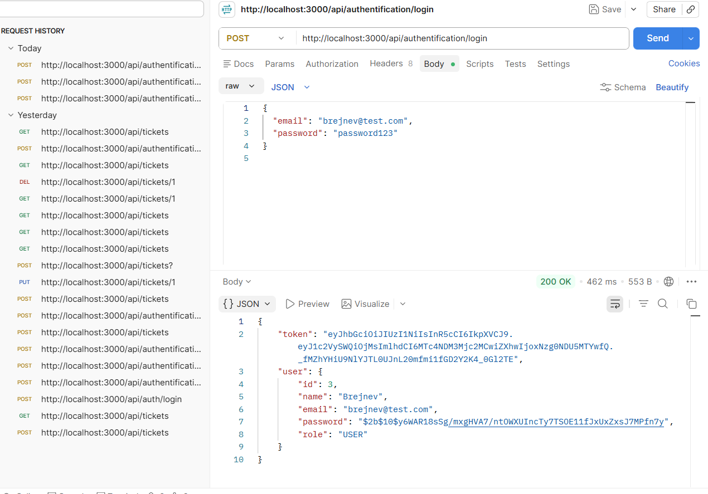

## Impact
Cette vulnérabilité expose des informations sensibles de la base de données et augmente le risque de compromission des comptes utilisateurs.

## Criticité
Moyenne

## Correction appliquée (branche `secure`)
Le backend ne retourne plus le champ `password`.
Seules les informations nécessaires sont renvoyées au client :
{
   "id": 3,
   "name": "Brejnev",
   "email": "brejnev@test.com",
   "role": "USER"
}

## Validation après correction
Après correction, La réponse utilisateur est maintenant filtrée avant d'être envoyée au client. Un mapper dédié a été ajouté :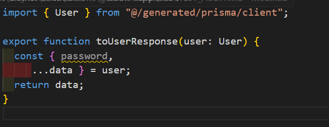

- Ce traitement permet de supprimer automatiquement les données sensibles.Le backend retourne uniquement les informations nécessaires.

Résultat obtenu : 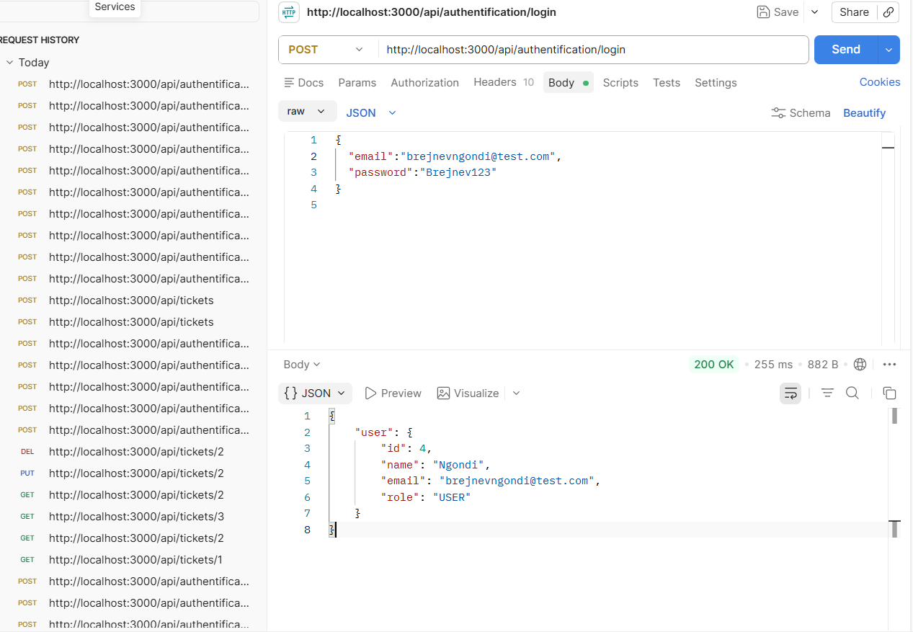

# 3 — Validation insuffisante des entrées
## Type
Input Validation / Injection Risk

## Endpoints concernés
- `POST /api/authentification/register`
- `POST /api/authentification/login`

## Description
Dans la version vulnerable, les données envoyées par l'utilisateur sont directement utilisées par l'application sans validation stricte.
Les champs reçus depuis le client ne sont pas contrôlés avant d'être traités par le backend.
Exemples de données acceptées :

- email avec un format incorrect ;
- mot de passe trop court ;
- champs obligatoires absents ;
- valeurs inattendues.

## Cause
La version vulnerable ne possède pas de schéma de validation côté serveur.
Les données sont directement utilisées :

const body = await request.json();
await prisma.user.create({
  data: body
});

## Exploitation
Un utilisateur peut envoyer des données invalides à l'API d'inscription ou de connexion

## Preuves
Test réalisé avec Postman :
1. Envoi d'une requête d'inscription avec des données invalides.
2. Utilisation d'un email non conforme.
3. Utilisation d'un mot de passe trop court.

## Impact
Cette vulnérabilité peut provoquer :
1. L'enregistrement de données incorrectes ;
2. Des erreurs applicatives ;
3. Un mauvais fonctionnement des fonctionnalités métier ;
4. Une augmentation du risque d'exploitation par injection.

## Criticité
Moyenne

## Validation après correction
Une validation côté serveur a été ajoutée avec la bibliothèque Zod.
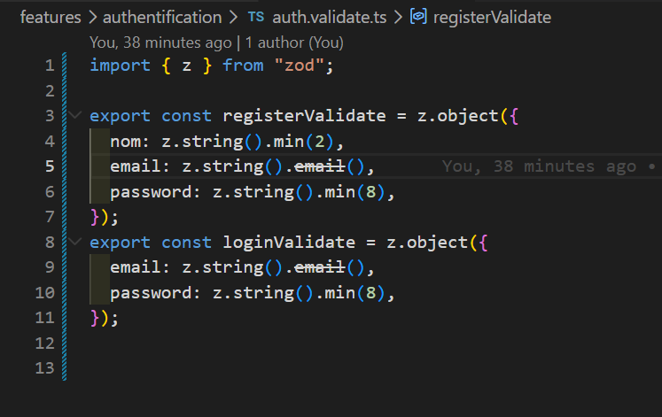

# 4 — Authentification faible / Absence de protection contre le brute force
## Type
Identification and Authentication Failures

## Endpoint concerné
- `POST /api/authentification/login`

## Description
Dans la version vulnerable, l'application ne possède aucun mécanisme de limitation des tentatives de connexion.
Un attaquant peut envoyer un grand nombre de requêtes avec différents mots de passe afin de tenter de découvrir les identifiants d'un utilisateur.

L'API traite chaque tentative de connexion sans appliquer de restriction.

## Cause
L'API de connexion vérifie uniquement les informations fournies :
- email ;
- password.

Aucune protection contre les attaques automatisées n'est présente :
- absence de rate limiting ;
- absence de limitation du nombre de requêtes ;
- absence de blocage temporaire.

Dans la version vulnerable, une même adresse IP peut effectuer un nombre illimité de tentatives de connexion.

## Exploitation
Un attaquant peut envoyer plusieurs requêtes successives :

POST /api/authentification/login

Avec différents mots de passe :
{
  "email": "user@test.com",
  "password": "123456"
}

{
  "email": "user@test.com",
  "password": "password"
}

{
  "email": "user@test.com",
  "password": "admin123"
}

L'application continue de répondre normalement sans bloquer l'utilisateur.

## Preuves
- Test réalisé avec Postman :
- Plusieurs tentatives de connexion échouées sont envoyées successivement.
Exemple de réponse :

{
  "message": "Identifiants incorrects"
}

Résultat obtenu : 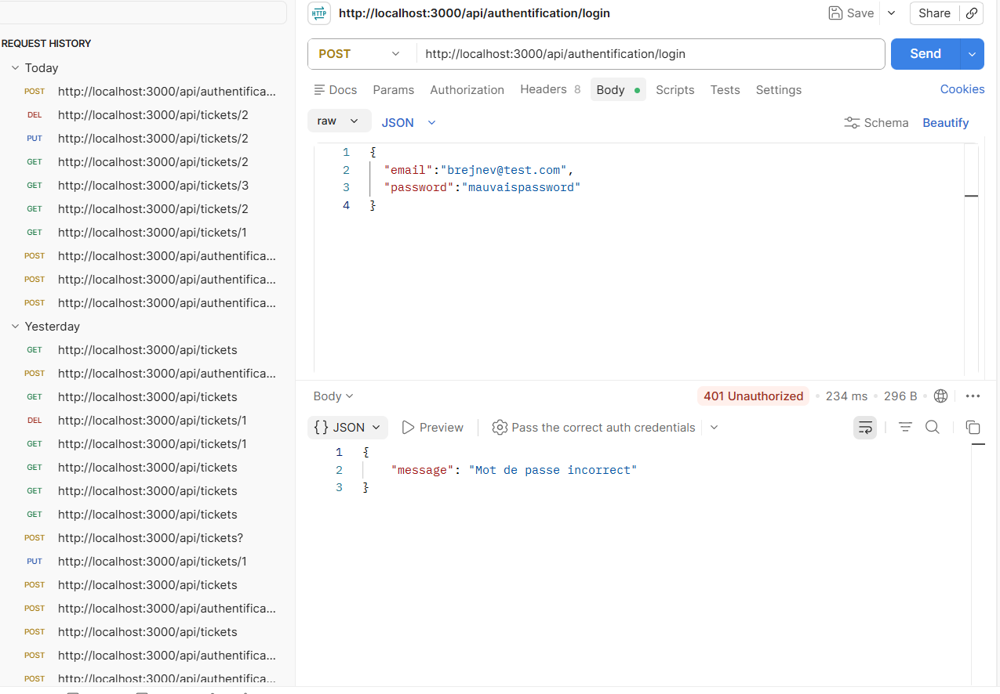

La requête peut être répétée sans aucune restriction.

## Impact
Cette vulnérabilité permet :
- des attaques par force brute ;
- des attaques par dictionnaire ;
- la compromission potentielle des comptes utilisateurs.

## Criticité
Elevée

## Correction appliquée (branche `secure`)
Ajout d'un système de limitation des tentatives de connexion :
- Limitation par adresse IP ;
- Une limite maximale de tentatives ;
- Limitation par email ;
- Blocage temporaire après plusieurs échecs.

Exemple :
Si 5 tentatives échouent,
bloquer temporairement la connexion.

## Validation après correction
Après correction :
- plusieurs tentatives échouées déclenchent une limitation ;
- l'API retourne une erreur `429 Too Many Requests`.
Exemple :
{
  "message": "Trop de tentatives. Réessayez plus tard."
}
Résultat obtenu : 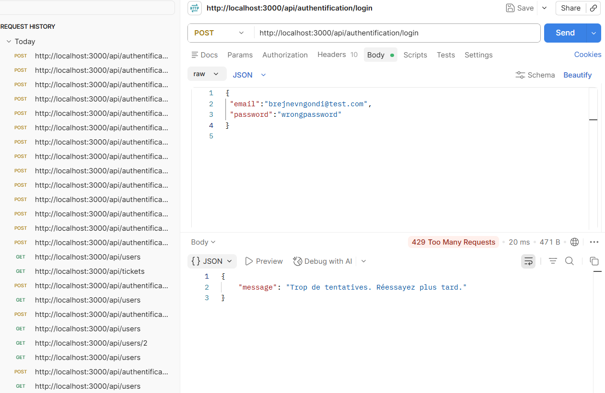

# 5 — Cross-Site Scripting (Stored XSS)
## Type
Injection

## Endpoint concerné
- POST /api/tickets
- Page `/Administration`

## Description
L'application permet de stocker du contenu JavaScript dans les descriptions des tickets.
Lorsqu'un autre utilisateur consulte le ticket, le script est exécuté dans son navigateur.

## Cause
Les données utilisateurs sont affichées sans filtrage HTML.
L'utilisation de :

dangerouslySetInnerHTML

permet l'exécution directe du contenu fourni par l'utilisateur.

## Exploitation
Un utilisateur crée un ticket contenant :

<script>alert('XSS')</script>

Lorsqu'un utilisateur consulte le ticket, le navigateur exécute le script.

## Preuves
- Requête Postman contenant le payload XSS.

Résultat obtenu : 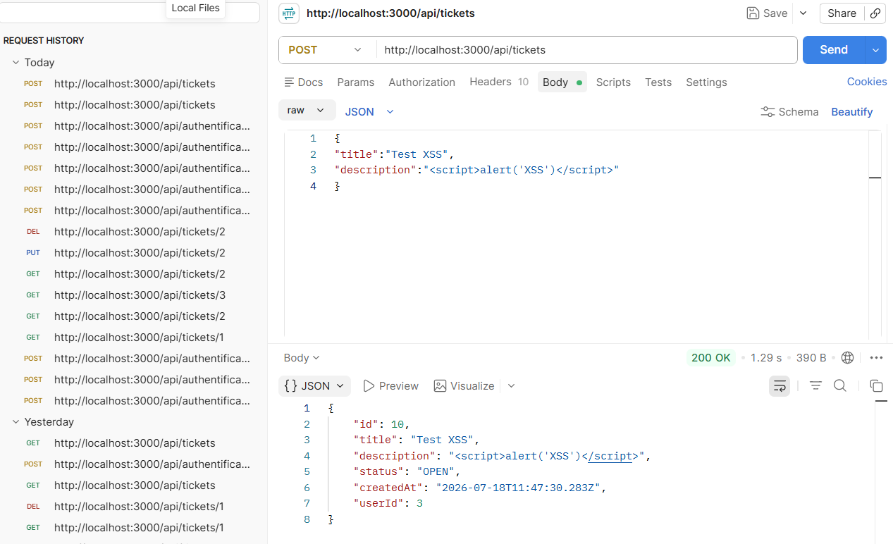

## Impact
Cette vulnérabilité peut permettre :
- le vol de cookies ;
- le vol de données utilisateur ;
- l'exécution d'actions au nom de la victime.

## Criticité
Élevée

## Correction appliquée (branche secure)
Suppression de l'affichage HTML non sécurisé.
Utilisation du rendu React classique :

{ticket.description}

ou ajout d'un système de nettoyage HTML.

## Validation après correction
Les scripts envoyés dans un ticket sont affichés comme du texte et ne sont plus exécutés dans le navigateur.

# 6 — Mass Assignment / Privilege Escalation
## Type
Insecure Design

## Endpoint concerné

- PUT /api/users/[id]

## Description
L'API accepte directement les données envoyées par l'utilisateur sans filtrer les champs modifiables.
Un utilisateur peut modifier des propriétés sensibles comme son rôle.

## Cause
- Le backend utilise directement les données reçues :
data: body
Tous les champs sont donc modifiables.

## Exploitation
Un utilisateur normal envoie :
json
{
"role":"ADMIN"
}

L'application applique la modification sans contrôle.

## Preuve
Une requête PUT permet de modifier le rôle USER vers ADMIN.
Résultat obtenu : 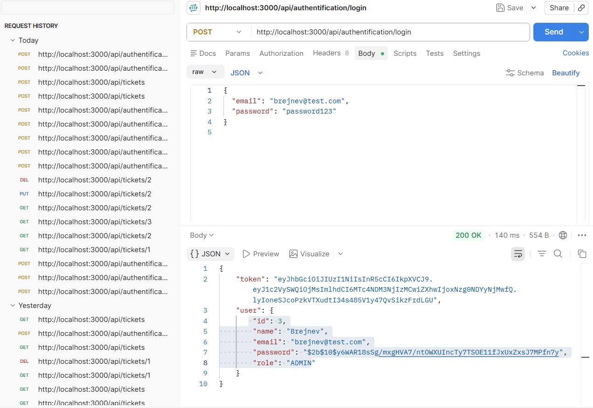

## Impact
Un attaquant peut obtenir des privilèges administrateur et accéder à des ressources protégées.

## Criticité
Critique

## Correction appliquée (branche secure)
Les champs modifiables sont explicitement définis.
Le rôle ne peut être modifié que par un administrateur.

## Validation après correction
Un utilisateur normal ne peut plus modifier son rôle.
Toute tentative retourne une erreur d'autorisation.

# 7 — JWT mal sécurisé / Stockage du token dans Local Storage
## Type
Identification and Authentication Failures

## Endpoint / zone concernée
### Backend
POST /api/authentification/login

### Frontend
app/login/page.tsx

## Description
Après une authentification réussie, l'application stocke le token JWT dans le `localStorage` du navigateur.
Cette méthode présente un risque de sécurité car le token est accessible depuis JavaScript côté client.
En cas d'exploitation d'une vulnérabilité XSS, un attaquant pourrait récupérer ce token et l'utiliser pour usurper l'identité d'un utilisateur.

## Cause technique
Le token JWT est enregistré directement dans le navigateur :
localStorage.setItem("token", data.token);
Le stockage `localStorage` n'applique aucune protection particulière :
- pas de protection HttpOnly ;
- accessible par les scripts JavaScript ;
- disponible jusqu'à sa suppression.

## Exploitation
Un attaquant exploitant une faille XSS peut exécuter du code JavaScript permettant de récupérer le token : localStorage.getItem("token")

Le token obtenu peut ensuite être utilisé dans les requêtes API :

Authorization: Bearer TOKEN_VOLÉ

L'attaquant peut alors effectuer des actions avec les droits de la victime.

## Preuve
Test réalisé dans le navigateur :
1. Connexion avec un compte utilisateur.
2. Ouverture des outils développeur.
3. Navigation vers :

Résultat obtenu : 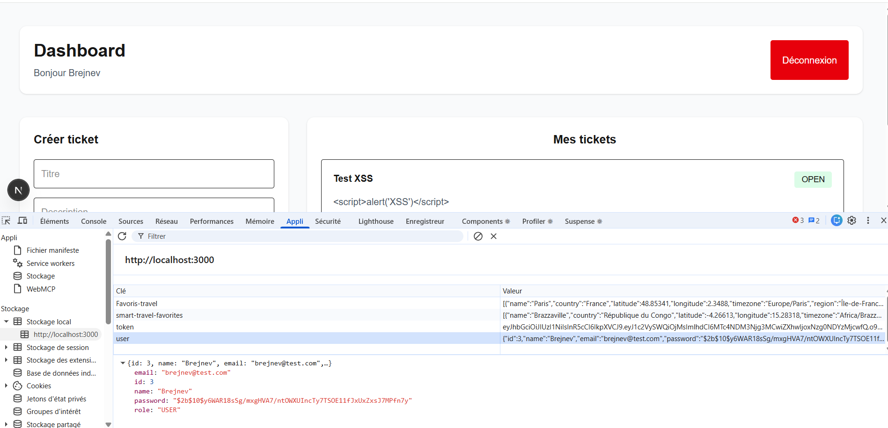

- Application
 → Local Storage
 → localhost:3000

4. Observation de la présence du JWT.
Exemple :
token =eyJhbGciOiJIUzI1NiIsInR5cCI6...
Une capture d'écran du Local Storage contenant le token est ajoutée au rapport.

## Impact
Cette vulnérabilité peut permettre :
- le vol de session utilisateur ;
- l'usurpation d'identité ;
- l'accès aux données privées ;
- l'exécution d'actions avec les permissions de la victime.

## Criticité
Élevée

## Correction appliquée (branche `secure`)
Le stockage du JWT dans `localStorage` est supprimé.
Le token est désormais stocké dans un cookie sécurisé :

- HttpOnly : inaccessible depuis JavaScript ;
- Secure : envoyé uniquement en HTTPS ;
- SameSite : protection contre certaines attaques CSRF.

Exemple :

response.cookies.set(
  "access_token",
  token,
  {
    httpOnly: true,
    secure: true,
    sameSite: "strict"
  }
);

## Validation après correction
Après correction :
- le JWT n'est plus stocké dans le Local Storage ;
- le token est envoyé uniquement via des cookies HttpOnly ;
- le navigateur contient :
  - access_token
  - refresh_token

La récupération :
localStorage.getItem("token")

Résultat obtenu : 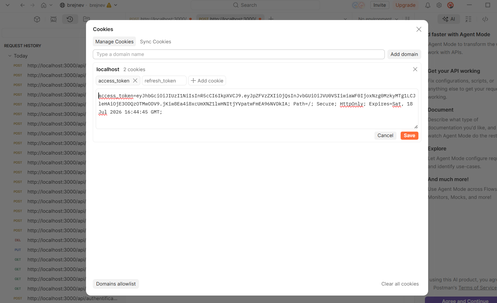

retourne :
null

Les cookies HttpOnly empêchent l'accès au token depuis JavaScript.
La faille est considérée comme corrigée.

# 8 — Security Misconfiguration / Absence de Security Headers
## Type
Security Misconfiguration

## Endpoint / zone concernée
http://localhost:3000

Toutes les réponses HTTP de l'application sont concernées.

## Description
L'application ne configure pas certains headers HTTP de sécurité permettant de renforcer la protection du navigateur.
L'absence de ces protections peut faciliter certaines attaques comme :
- Clickjacking ;
- Attaques XSS ;
- Interprétation incorrecte du contenu ;
- Exploitation de certaines failles côté navigateur.

## Cause technique
La version vulnerable ne définit pas de middleware de sécurité ajoutant des headers HTTP.
Les réponses serveur ne contiennent pas de protections supplémentaires comme :
- X-Frame-Options
- X-Content-Type-Options
- Content-Security-Policy
- Referrer-Policy

## Exploitation
Un attaquant peut profiter de l'absence de ces protections pour :
- Intégrer l'application dans une iframe malveillante;
- Augmenter l'impact d'une vulnérabilité XSS ;
- Exploiter des comportements non sécurisés du navigateur.

Exemple :
<iframe src="http://localhost:3000/administration"></iframe>

Sans protection adaptée, la page peut être chargée dans un autre site.

## Preuve
Test réalisé avec la commande :
curl -I http://localhost:3000
Résultat obtenu : 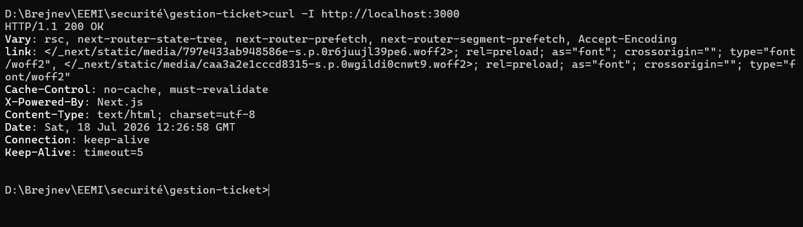

Résultat observé dans la version vulnerable :
HTTP/1.1 200 OK
Content-Type: text/html

Les headers de sécurité attendus sont absents.
Capture de la réponse HTTP ajoutée au rapport.
## Impact
Cette mauvaise configuration peut permettre :
- Des attaques Clickjacking ;
- Une réduction de la protection contre les attaques XSS ;
- Une augmentation de la surface d'attaque côté navigateur.

## Criticité
Moyenne

## Correction appliquée (branche `secure`)
Un middleware Next.js a été ajouté afin d'ajouter automatiquement des headers de sécurité sur les réponses HTTP.
Fichier concerné :
- middleware.ts

Exemple :
import { NextResponse } from "next/server";
import type { NextRequest } from "next/server";
export function middleware(request: NextRequest) {
  const response = NextResponse.next();
  response.headers.set(
    "X-Content-Type-Options",
    "nosniff"
  );
  response.headers.set(
    "X-Frame-Options",
    "DENY"
  );
  response.headers.set(
    "Content-Security-Policy",
    "default-src 'self'"
  );
  return response;
}

## Validation après correction
Après correction :
La commande :
curl -I http://localhost:3000


retourne les headers de sécurité :
X-Content-Type-Options: nosniff
X-Frame-Options: DENY
Content-Security-Policy: default-src 'self'

La configuration de sécurité du navigateur est renforcée.
Résultat obtenu : 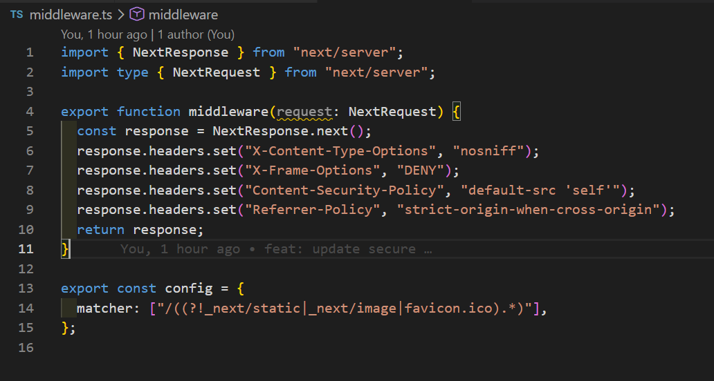

# 9 — Pipeline DevSecOps
## Objectif
Automatiser les contrôles de sécurité avant déploiement.

## Outil utilisé
GitHub Actions

## Contrôles réalisés
- SAST : Semgrep
- SCA : npm audit
- Secret scanning : Gitleaks
- DAST : OWASP ZAP

## Déclenchement
La pipeline s'exécute sur :
- push sur secure
- pull request vers secure

## Résultat
Une modification contenant une vulnérabilité critique ou un secret exposé provoque l'échec de la pipeline.